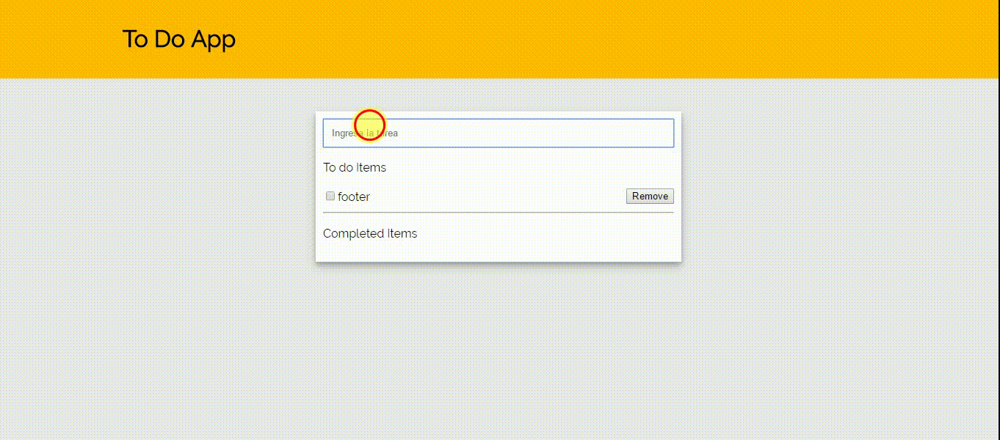

# L40toDo
Leccion 40 ejercicio guiado TODO

## El proyecto
Se realizó el proyecto usando el patrón de diseño similar a react:

- El proyecto se baso en hacer una página web que puede agregar un item y cambiarla de estado.
- En el proyecto se usó Jquery, es6.

## ToDo: contenido

### Todo

## Desarrollado con:

`HTML` `JavaScript` `CSS` `ES6`
